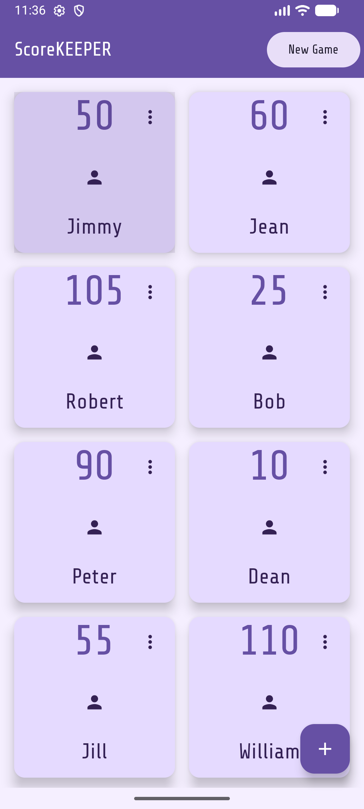
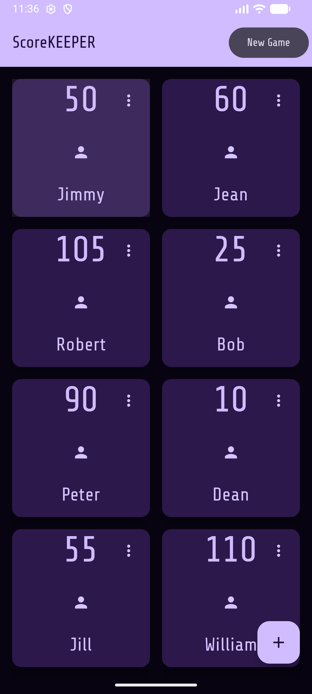

  

    
ScoreKEEPER

    <h1>Scorekeeping that keeps up with the game</h1>
    

      Track cards, boards, or party games without slowing the table down.
      Add players on the fly, keep turns moving, and stay focused on the fun.
    

    

      <a class="button primary disabled" aria-disabled="true" role="button">Google Play - coming soon</a>
      <a class="button ghost" href="#privacy">Privacy first</a>
    

    <ul class="pill-list">
      <li>Fast score edits</li>
      <li>Add or remove players any time</li>
      <li>Offline by default</li>
    </ul>
  

  

    

      
      
    

  

## Why you'll like it

  

    
Flexible games

    <h3>Any table, any rules</h3>
    
Card games, board nights, or a quick round of trivia. ScoreKEEPER adapts to however your group plays.

  

  

    
Fast updates

    <h3>Tap, adjust, done</h3>
    
Keep the game flowing with quick score edits and clean visibility from across the table.

  

  

    
Player control

    <h3>Add or drop on the fly</h3>
    
Pull in a new player mid-round or pause someone out without restarting the score sheet.

  

  

    
Made for the room

    <h3>Readable, low-glare UI</h3>
    
Dark, contrast-friendly styling keeps the screen easy to read without lighting up the room.

  

## Availability

  <h3>Android release is on deck</h3>
  
The Google Play link will appear here as soon as publishing is live. In the meantime, ScoreKEEPER is built to run fully offline.

## Privacy 

  <h3>Offline by design</h3>
  <ul class="checklist">
    <li>No accounts</li>
    <li>No analytics or ads</li>
    <li>No tracking</li>
    <li>All scores stay on your device</li>
  </ul>
  
Read the full <a href="./privacy">Privacy Policy</a> for details.

