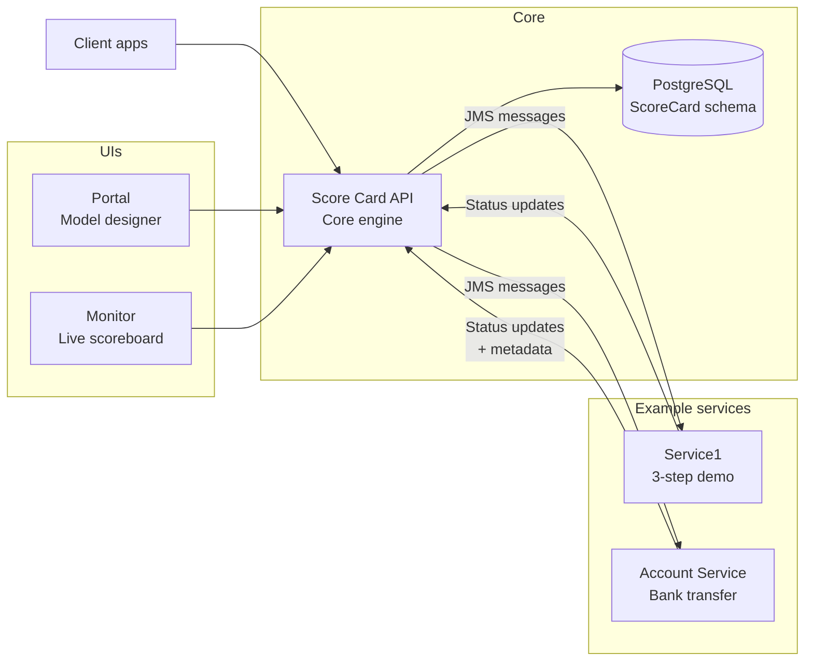

> _How far can you get by **watching** distributed transactions instead of trying to **control** them?_
> This is the core question behind the Score Card project.

If you’ve ever tried to implement a “simple” cross-service transaction — like transferring money between two accounts that live in different microservices — you already know the pain:

- Some steps succeed, others fail.
- There’s no global transaction manager.
- Every service has its own database and commit cycle.
- Your logs tell **part** of the story, but never the whole thing.

Score Card is my experiment in attacking that problem from a different angle. Instead of reaching for a classic distributed transaction manager or building a heavy saga orchestrator, I asked:

> **What if we treat the transaction as an _observable phenomenon_ instead of something we tightly orchestrate?**

The result is a system that models cross-service workflows explicitly, but coordinates them mostly through **events, correlation IDs, and lightweight authorization rules**. The formal write-up lives in the repo’s research-style README; this post is the conversational tour.

---

## Why Distributed Transactions Still Hurt

In a microservices world, a single business operation rarely lives in one place:

- A **funds transfer** might touch an account service, a ledger service, and a notification service.
- A **user onboarding** flow might call identity, KYC, email, and billing services.

We’d love to say “this is one transaction — either it all happens or none of it does.” But we usually **don’t**:

- Two-phase commit (2PC) and XA-style transactions add tight coupling, complex failure modes, and scaling headaches.
- Purely event-driven sagas avoid a central coordinator, but the workflow logic gets smeared across services and topics.

You end up with a familiar gap:

> Each service knows what _it_ did. No one knows what **actually happened** across the whole business flow.

Score Card lives in that gap.

---

## The Core Idea: A Transaction as a "Score Card"

Score Card introduces a simple mental model:

- A **Service**: some independent system (microservice) that can perform actions.
- An **Action**: a unit of work on a service (e.g., `debit`, `credit`, `sendEmail`).
- A **Transaction**: a blueprint that wires actions together (with ordering / dependencies).
- A **Score Card**: a _runtime instance_ of a transaction: _this concrete transfer_, _this onboarding_, etc.

At runtime, Score Card doesn’t try to run your business logic. Instead, it does three things really well:

1. **Assigns a Score Card ID** to a transaction instance.
2. **Tracks every action** tied to that ID, including:

   - Status (`PENDING`, `PROCESSING`, `COMPLETED`, `FAILED`, `CANCELLED`, `UNKNOWN`)
   - Timestamps
   - Arbitrary metadata (error codes, internal transaction IDs, etc.)

3. **Applies dependency & failure rules** when services ask, “Should I run this action now?”

The services still own the work. Score Card owns the **story**.

---

## Architecture in One Diagram

Score Card is deliberately modular. Here’s the big picture, simplified:



At the center is the **Core API** — a Spring Boot service backed by PostgreSQL and ActiveMQ. It exposes REST endpoints for managing:

- Services, actions, and transactions (the **model**).
- Score Cards and action statuses (the **runtime state**).

On the edges:

- **Monitor** is a read-only UI that lets you watch transactions in real time.
- **Portal** is a configuration UI for designing the model without touching JSON or SQL.
- **Example services** simulate real microservices and show how to integrate via JMS.

---

## How Services Participate (Without Getting Coupled)

Here’s the most important design constraint:

> **Services should not depend on each other – only on Score Card.**

Integration is intentionally simple:

1. Score Card sends a JMS message to a service queue:

   - Destination is based on the service’s configured path, e.g., `"account"`.
   - Message property `ACTION` tells the service _which_ action (`debit`, `credit`, etc.).
   - A `SCORE_CARD` header carries a small JSON blob: `{ scoreCardId, actionId }`.

2. The service’s listener receives the message and calls **`authorize`** via the integration library:

   ```java
   var auth = scoreCardApiService.authorize(header);
   ```

   Score Card checks dependencies and global status and returns one of:

   - `PROCESS` — go ahead and execute.
   - `WAIT` — dependencies not satisfied yet; try later.
   - `CANCEL` — transaction is being aborted; don’t run this.
   - `SKIP` — no-op for this action.

3. The service either performs the action or throws a custom `WaitException` so the message is redelivered later.

4. When the work is finished (or fails), the service calls **`updateStatus`**:

   ```java
   scoreCardApiService.updateStatus(header, COMPLETED, metadata);
   ```

   The metadata might include an internal transaction ID, an error code like `NSF`, or anything else that helps future analysis.

The result is a nice separation of concerns:

- Services don’t know the transaction graph.
- Score Card doesn’t know how you debit, credit, or send emails.
- Everyone speaks via **messages + status updates**.

---

## A Banking Transfer, Step by Step

Let’s walk through the concrete example the paper is built around: a simple **bank transfer**.

### 1. The blueprint

In the model, there’s a transaction named `bank-transfer` with two actions:

1. `debit` on `account-service`
2. `credit` on `account-service`

With a dependency: **`credit` depends on `debit`**.

### 2. Creating a Score Card

A client (or the example app) calls the API to:

1. Get a new Score Card ID.
2. Create a Score Card for `bank-transfer`.
3. Submit two messages to the `account` queue: one for `debit`, one for `credit`, both tagged with the same Score Card ID.

### 3. Execution & authorization

The Account Service now sees two messages:

- The **debit** listener calls `authorize`.

  - No dependencies -> Score Card returns `PROCESS`.
  - The service checks balance, debits the account, and sends `COMPLETED` back with metadata:

    - internal transaction ID
    - maybe a description or audit reference

- The **credit** listener might fire around the same time, but when it calls `authorize` the first time:

  - Score Card sees its dependency (`debit`) is still `PENDING`.
  - It returns `WAIT`.
  - The listener throws `WaitException`; the message is rolled back and will be retried later.

When the debit completes and Score Card records it, the next retry of the credit message gets `PROCESS`, and the credit runs.

### 4. Handling failures with compensation

Two interesting failure cases from the paper’s implementation:

- **Insufficient funds on debit** (`NSF`):

  - Debit fails, action status becomes `FAILED` with metadata `{ error_code: "NSF" }`.
  - Score Card, seeing a failure, cancels any remaining actions.
  - The credit action is updated to `CANCELLED` and never runs.

- **Destination account doesn’t exist on credit**:

  - Debit succeeds and is `COMPLETED`.
  - Credit fails with an `ACCOUNT_DNE` error.
  - A scheduled **repair service** scans for `bank-transfer` Score Cards with partial failure.
  - When it finds one, it:

    - Reads metadata from the original debit.
    - Starts a new, one-step `bank-credit` transaction that credits the **source account** back.
    - Marks the original credit action as `CANCELLED`.

From a business perspective, the system is doing a saga-style compensation — but the coordination is driven by **observability data** in Score Card, not by a central orchestrator that owns all the domain logic.

---

## What Score Card Can Tell You

Because every action is tracked under a Score Card, you can ask questions that are usually painful in microservice architectures:

- _"Did this transfer actually complete end-to-end?"_
- _"Which services took part in this order?"_
- _"Where did this onboarding flow fail, and why?"_
- _"How often do we hit NSF vs bad destination account errors?"_
- _"How long does each step usually take?"_

And you get answers from a **single place**:

- The **Monitor UI** for operational visibility.
- The **REST API** for automation, dashboards, and ad-hoc queries.

This works even though:

- Services remain independently deployable.
- Databases are not shared.
- There is no global XA transaction.

---

## Design Choices That Mattered

A few choices from the paper that I think are worth highlighting:

### 1. Model first, not messages first

The paper leans hard into a clear domain model:

- Service
- Action
- Transaction
- Score Card
- Score Card Action

That may sound heavy, but it pays off:

- Dependencies are explicit and queryable.
- You can design flows visually in the Portal.
- You have a natural place to attach metadata and rules.

### 2. Authorization as a soft coordination point

Instead of having the Core API push and orchestrate every step, the **services pull** a decision:

```java
Authorization auth = scoreCardApiService.authorize(header);
```

This is where the system quietly enforces:

- Ordering (dependencies satisfied?)
- Cancellation rules (has anything already failed?)

By keeping this logic in a small, explicit API, services stay dumb and loosely coupled, but you still get enough coordination to avoid chaos.

### 3. Metadata as a first-class citizen

The ability for services to attach arbitrary metadata to action updates is huge:

- Domain error codes (`NSF`, `ACCOUNT_DNE`)
- Internal transaction IDs for later compensation
- Anything else you might want to slice and analyze later

Score Card effectively becomes a **domain-aware transaction log**.

---

## What This Isn’t (Yet)

The README is honest about limitations, and they’re important if you think about production use:

- Failure handling is intentionally simple: first failure usually means cancel the rest.
- There’s no built-in timeout for actions that never report back.
- HTTP-based integration is supported in the model but only partially exercised in the code; JMS is the main path.
- There’s no security story yet (auth/z, multi-tenant separation, etc.).
- It’s not horizontally sharded; Score Card is a single logical service.

That’s okay. This is a **research project with working code**, not a drop-in replacement for your bank’s core.

But it points to interesting future work:

- Per-transaction failure policies.
- Configurable timeouts and retries.
- First-class compensation definitions.
- Integration with OpenTelemetry so Score Card views and distributed traces share a common language.

---

## Why This Approach Feels Promising

What I like most about the Score Card pattern is its attitude:

> Don’t fight the distributed nature of the system. **Lean into it and watch carefully.**

Instead of:

- Forcing everything into a faux-monolith via global transactions, or
- Letting every service spray events into the void with no coherent audit trail,

Score Card sketches out a third path:

- Explicitly model your cross-service workflows.
- Use **observability signals** (messages, statuses, metadata) as the glue.
- Keep services independent, but give operators and tooling a clear, unified view.

If you’re living in the world of microservices, sagas, and eventual consistency, the full research-style README in the Score Card repo is worth a read. And if you’re tired of debugging “he said / she said” incidents across 12 services, you may find this pattern surprisingly therapeutic.

---

## Want to Explore the Code?

You can find the paper-like README, API modules, UIs, and example services here:

- **Repository:** [https://github.com/zmad5306/ScoreCard](https://github.com/zmad5306/ScoreCard)
- **Research-style README:** [README.md](https://github.com/zmad5306/ScoreCard/blob/main/README.md) in the root
- **Setup details:** [GETTING_STARTED.md](https://github.com/zmad5306/ScoreCard/blob/main/GETTING_STARTED.md)

Run it, break it, and see how far observability-driven composition can take you in your own systems.
